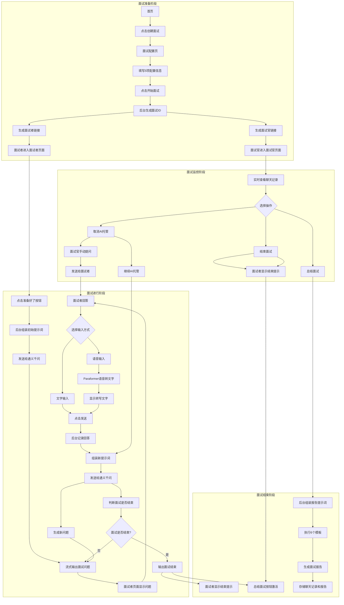
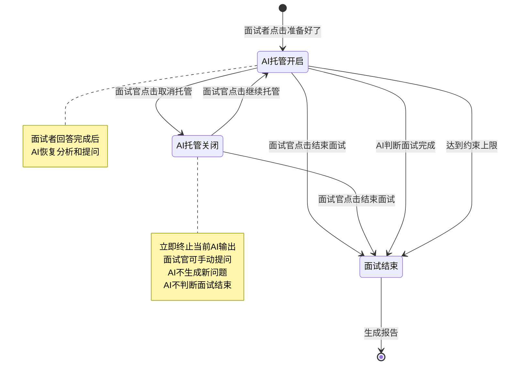
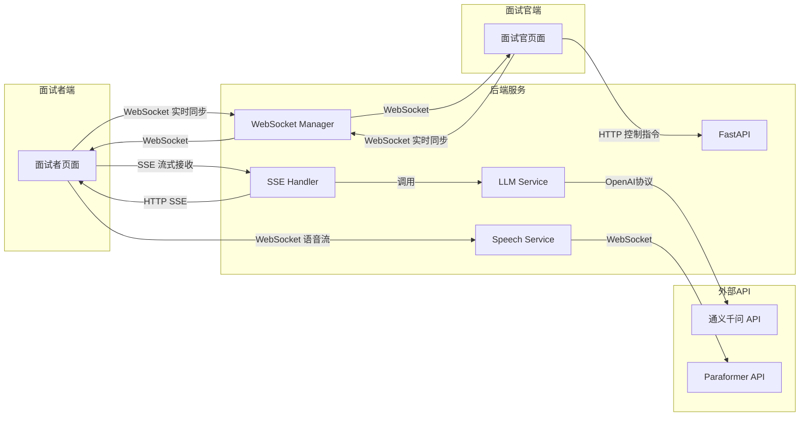
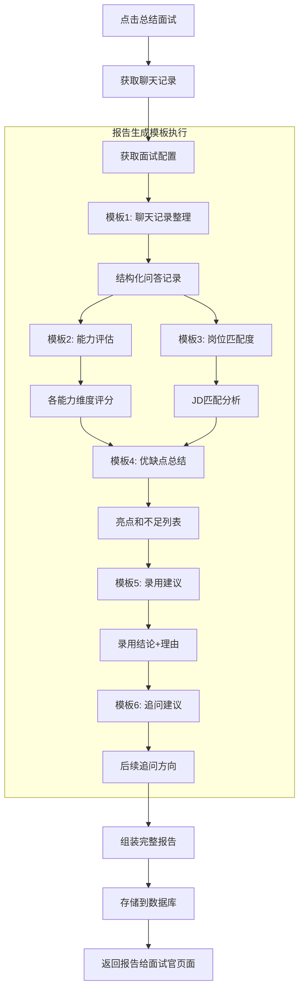
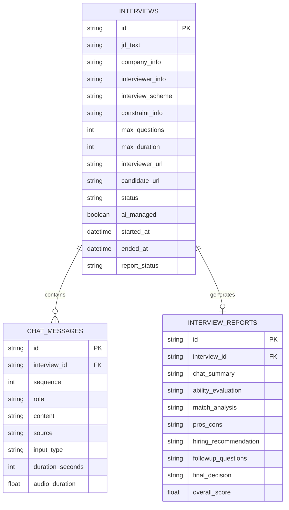

# InterviewPilot - 企业AI面试智能体 设计文档

**文档版本**: v1.0
**创建日期**: 2026-04-17
**状态**: 待审核

---

## 1. 项目概述

### 1.1 项目定位

InterviewPilot 是一款企业级 AI 面试智能体系统，适用于初面场景。系统基于面试官配置的岗位 JD、公司信息、面试面试方案等信息，通过 AI 自动对面试者进行面试提问，最终生成人才画像、分析报告和录用指南。

### 1.2 核心价值

- **自动化初面流程**: AI 托管面试，减少面试官重复性工作
- **标准化面试评估**: 基于 JD 和配置生成针对性问题，确保评估一致性
- **实时监控与干预**: 面试官可全程观看并随时接管面试
- **智能报告生成**: 多维度分析，输出专业录用建议

### 1.3 使用场景

- 公司内网服务，局域网内使用
- 无登录验证，简化使用流程
- 面试官一键创建面试，生成面试者链接

---

## 2. 功能需求清单

### 2.1 核心功能

| 功能模块 | 功能点 | 优先级 | 说明 |
|---------|--------|--------|------|
| **首页** | 创建面试入口 | P0 | 一键创建面试，跳转配置页 |
| **面试配置页** | 岗位 JD 输入 | P0 | 必填，文本输入框 |
| | 公司信息输入 | P0 | 必填，文本输入框 |
| | 面试偏好信息输入 | P0 | 必填，姓名、职位等 |
| | 面试方案输入 | P0 | 必填，面试轮次、考察重点 |
| | 约束信息输入 | P0 | 必填，最大问题数、最大时长 |
| | 开始面试按钮 | P0 | 生成面试官/面试者链接 |
| **面试者页面** | 聊天框 | P0 | 流式输出显示 |
| | 文字输入 | P0 | 回答问题 |
| | 语音输入 | P0 | 语音转文字（Paraformer API） |
| | "准备好了"按钮 | P0 | 触发 AI 开始提问 |
| | 面试结束提示 | P0 | 面试结束显示感谢语 |
| **面试官页面** | 实时聊天同步 | P0 | 全程查看聊天记录 |
| | 取消/继续 AI 托管 | P0 | 切换托管模式 |
| | 手动提问输入框 | P0 | 取消托管后启用 |
| | 结束面试按钮 | P0 | 手动结束面试 |
| | 总结面试按钮 | P0 | 生成面试报告 |
| **面试报告** | 聊天记录整理 | P0 | 结构化问答记录 |
| | 能力评估 | P0 | 各维度评分 |
| | 岗位匹配度 | P0 | JD 匹配分析 |
| | 优缺点总结 | P0 | 亮点与不足 |
| | 录用建议 | P0 | 推荐/不推荐/待定 |
| | 追问建议 | P1 | 后续面试追问方向 |
| **面试记录页** | 历史面试列表 | P0 | 查看所有面试记录 |
| | 面试详情查看 | P0 | 配置、聊天、报告 |

### 2.2 面试结束条件（组合条件）

面试在以下任一条件下结束：

1. **AI 自动判断**: 大模型根据面试情况判断面试已完成
2. **面试官手动结束**: 点击"结束面试"按钮
3. **达到约束上限**:
   - 达到配置的最大问题数
   - 达到配置的最大时长

### 2.3 AI 托管状态流转

```
初始状态: AI托管开启
    │
    ├── 点击"取消AI托管" ──► AI托管关闭
    │   │
    │   ├── 面试官可手动提问
    │   ├── 立即终止当前AI输出
    │   ├── AI不生成新问题
    │   ├── AI不判断面试是否结束
    │   │
    │   └── 点击"继续AI托管" ──► AI托管开启
    │       │
    │       └── 面试者回答完成后，AI恢复分析和提问
    │
    ├── 点击"结束面试" ──► 面试结束
    │   │
    │   ├── 面试者页面显示结束提示
    │   ├── "总结面试"按钮激活
    │   │
    │   └── 点击"总结面试" ──► 生成报告
    │
    └── AI判断面试完成 ──► 面试结束
```

---

## 3. 业务数据流程图

### 3.1 整体面试流程



### 3.2 AI托管状态流转图



### 3.3 实时通信数据流图



### 3.4 面试报告生成流程



---

## 4. 技术架构

### 4.1 技术栈选型

| 层级 | 技术选择 | 说明 |
|------|---------|------|
| **前端** | React 18 | 组件化开发 |
| **后端** | Python + FastAPI | 高性能异步框架 |
| **数据库** | SQLite | 轻量级，局域网使用 |
| **LLM** | 阿里通义千问 | OpenAI 协议兼容 |
| **语音识别** | 阿里 Paraformer | WebSocket 实时转写 |
| **实时通信** | SSE + WebSocket | 混合架构 |
| **流式聊天** | Vercel AI SDK | React 端流式处理 |

### 4.2 系统架构图

```
┌─────────────────────────────────────────────────────────────────────────┐
│                        InterviewPilot 系统架构                           │
├─────────────────────────────────────────────────────────────────────────┤
│                                                                          │
│  ┌───────────────────────────────────────────────────────────────────┐  │
│  │                         前端层 (React)                             │  │
│  ├───────────────────────────────────────────────────────────────────┤  │
│  │  页面组件:                                                        │  │
│  │  ├── HomePage          首页（创建面试入口）                       │  │
│  │  ├── ConfigPage        面试配置页（5项配置表单）                   │  │
│  │  ├── CandidatePage     面试者页面（聊天+语音+控制）               │  │
│  │  ├── InterviewerPage   面试官页面（监控+控制）                    │  │
│  │  ├── HistoryPage       面试记录列表页                             │  │
│  │  ├── DetailPage        面试详情页（配置+聊天+报告）               │  │
│  │                                                                    │  │
│  │  核心组件:                                                        │  │
│  │  ├── ChatBox            流式聊天框（useChat hook）                │  │
│  │  ├── VoiceInput         语音输入组件（MediaRecorder + WS）        │  │
│  │  ├── ControlPanel       控制按钮面板                              │  │
│  │  ├── ReportView         报告展示组件                              │  │
│  └───────────────────────────────────────────────────────────────────┘  │
│                                                                          │
│  ┌───────────────────────────────────────────────────────────────────┐  │
│  │                      后端层 (FastAPI + Python)                     │  │
│  ├───────────────────────────────────────────────────────────────────┤  │
│  │  API 路由:                                                        │  │
│  │  ├── /api/interview/create      POST 创建面试                     │  │
│  │  ├── /api/interview/{id}        GET 获取面试配置                  │  │
│  │  ├── /api/interview/history     GET 面试记录列表                  │  │
│  │  ├── /api/interview/{id}/detail GET 面试详情                      │  │
│  │  ├── /api/chat/stream           SSE  LLM 流式输出                 │  │
│  │  ├── /ws/interview/{id}         WS   实时双向同步                 │  │
│  │  ├── /ws/speech                 WS   语音转文字代理               │  │
│  │  ├── /api/control/toggle        POST 切换托管状态                 │  │
│  │  ├── /api/control/end           POST 结束面试                     │  │
│  │  ├── /api/report/generate       POST 生成报告                     │  │
│  │                                                                    │  │
│  │  服务层:                                                          │  │
│  │  ├── InterviewService   面试流程管理                              │  │
│  │  ├── LLMService         通义千问调用（OpenAI协议）                 │  │
│  │  ├── PromptService      6个提示词模板管理                          │  │
│  │  ├── ReportService      报告生成服务                              │  │
│  │  ├── SpeechService      语音转文字服务（Paraformer代理）          │  │
│  │  ├── WebSocketManager   WebSocket 连接管理                        │  │
│  │                                                                    │  │
│  │  数据层:                                                          │  │
│  │  ├── SQLite 数据库                                                │  │
│  │  ├── SQLAlchemy ORM                                              │  │
│  └───────────────────────────────────────────────────────────────────┘  │
│                                                                          │
│  ┌───────────────────────────────────────────────────────────────────┐  │
│  │                      外部服务 (阿里云 DashScope)                   │  │
│  ├───────────────────────────────────────────────────────────────────┤  │
│  │  ├── 通义千问 API                                                  │  │
│  │  │   URL: https://dashscope.aliyuncs.com/compatible-mode/v1       │  │
│  │  │   协议: OpenAI 兼容                                             │  │
│  │  │   模型: qwen-plus / qwen-turbo                                  │  │
│  │  │                                                                  │  │
│  │  ├── Paraformer 实时语音识别                                       │  │
│  │  │   URL: wss://dashscope.aliyuncs.com/api-ws/v1/inference         │  │
│  │  │   协议: WebSocket                                                │  │
│  │  │   模型: paraformer-realtime-v2                                  │  │
│  └───────────────────────────────────────────────────────────────────┘  │
│                                                                          │
└─────────────────────────────────────────────────────────────────────────┘
```

### 4.3 实时通信架构

```
┌─────────────────────────────────────────────────────────────────┐
│                    实时通信混合架构                               │
├─────────────────────────────────────────────────────────────────┤
│                                                                  │
│  SSE (Server-Sent Events)                                       │
│  ─────────────────────                                          │
│  用途: LLM 流式输出                                              │
│  特点:                                                          │
│  - 单向服务器推送                                                │
│  - 自动重连（EventSource API）                                   │
│  - 工业标准（OpenAI/Anthropic 使用）                             │
│  - 无需协议升级                                                  │
│                                                                  │
│  端点: /api/chat/stream (EventSourceResponse)                   │
│                                                                  │
│                                                                  │
│  WebSocket                                                       │
│  ──────────                                                      │
│  用途: 面试官/面试者实时同步 + 语音流                            │
│  特点:                                                          │
│  - 双向全双工通信                                                │
│  - 实时状态推送                                                  │
│  - 支持 binary 数据（音频）                                      │
│                                                                  │
│  端点:                                                           │
│  - /ws/interview/{id}  聊天实时同步                              │
│  - /ws/speech          语音转文字代理                            │
│                                                                  │
└─────────────────────────────────────────────────────────────────┘

数据流示例:

面试者回答 ──────────────────────────────────────────────────────►
                                                                  │
┌──────────────┐    WebSocket    ┌──────────────┐                 │
│ 面试者页面   │ ──────────────► │ WebSocket     │                 │
│              │                 │ Manager       │                 │
│              │                 │              │ ──► 存储回答    │
│              │                 │              │                  │
│              │ ◄────────────── │              │ ──► 同步给面试官│
└──────────────┘                 └──────────────┘                  │
                                                                  │
面试官页面 ───────────────────────────────────────────────────────►
                                                                  │
┌──────────────┐    WebSocket    ┌──────────────┐                 │
│ 面试官页面   │ ◄─────────────► │ WebSocket     │                 │
│              │                 │ Manager       │                 │
│              │ 实时同步聊天    │              │                  │
│              │ 控制指令        │              │                  │
└──────────────┘                 └──────────────┘                  │
                                                                  │
LLM 流式输出 ─────────────────────────────────────────────────────►
                                                                  │
┌──────────────┐    SSE          ┌──────────────┐                 │
│ 面试者页面   │ ◄─────────────► │ LLM Service   │                 │
│              │ 流式接收问题    │              │ ◄──► 通义千问   │
│              │                 │              │                  │
┌──────────────┐    SSE          └──────────────┘                  │
│ 面试官页面   │ ◄─────────────►                                    │
│              │ 同步接收问题    │                                   │
└──────────────┘                                                    │
```

---

## 5. 数据模型设计

### 5.1 数据库表结构

```sql
-- 面试表
CREATE TABLE interviews (
    id              TEXT PRIMARY KEY,          -- 面试ID（UUID）
    
    -- 配置信息（必填）
    jd_text         TEXT NOT NULL,             -- 岗位JD
    company_info    TEXT NOT NULL,             -- 公司信息
    interviewer_info TEXT NOT NULL,            -- 面试偏好信息
    interview_scheme TEXT NOT NULL,         -- 面试方案
    constraint_info TEXT NOT NULL,             -- 约束信息（JSON格式）
    
    -- 约束解析字段
    max_questions   INTEGER DEFAULT 10,        -- 最大问题数
    max_duration    INTEGER DEFAULT 1800,      -- 最大时长（秒）
    
    -- 面试链接
    interviewer_url TEXT NOT NULL,             -- 面试官链接
    candidate_url   TEXT NOT NULL,             -- 面试者链接
    
    -- 状态字段
    status          TEXT DEFAULT 'pending',    -- pending/ongoing/ended
    ai_managed      BOOLEAN DEFAULT TRUE,      -- AI托管状态
    started_at      DATETIME,                  -- 开始时间
    ended_at        DATETIME,                  -- 结束时间
    
    -- 报告状态
    report_status   TEXT DEFAULT 'pending',    -- pending/generating/completed
    
    created_at      DATETIME DEFAULT CURRENT_TIMESTAMP,
    updated_at      DATETIME DEFAULT CURRENT_TIMESTAMP
);

-- 聊天消息表
CREATE TABLE chat_messages (
    id              TEXT PRIMARY KEY,          -- 消息ID（UUID）
    interview_id    TEXT NOT NULL,             -- 面试ID
    sequence        INTEGER NOT NULL,          -- 消息序号
    
    -- 消息内容
    role            TEXT NOT NULL,             -- ai/interviewer/candidate
    content         TEXT NOT NULL,             -- 消息文本内容
    
    -- 元数据
    source          TEXT NOT NULL,             -- ai_generated/manual/system
    input_type      TEXT,                      -- text/voice（仅面试者回答）
    duration_seconds INTEGER,                  -- 回答用时（预留字段）
    
    -- 语音转写信息（如果是语音输入）
    audio_duration  REAL,                      -- 音频时长（秒）
    
    created_at      DATETIME DEFAULT CURRENT_TIMESTAMP,
    
    FOREIGN KEY (interview_id) REFERENCES interviews(id)
);

-- 面试报告表
CREATE TABLE interview_reports (
    id              TEXT PRIMARY KEY,          -- 报告ID（UUID）
    interview_id    TEXT NOT NULL UNIQUE,      -- 面试ID（一对一）
    
    -- 报告各部分内容
    chat_summary    TEXT,                      -- 模板1: 聊天记录整理
    ability_evaluation TEXT,                   -- 模板2: 能力评估
    match_analysis  TEXT,                      -- 模板3: 岗位匹配度
    pros_cons       TEXT,                      -- 模板4: 优缺点总结
    hiring_recommendation TEXT,                -- 模板5: 录用建议
    followup_questions TEXT,                   -- 模板6: 追问建议
    
    -- 综合结论
    final_decision  TEXT,                      -- recommend/not_recommend/pending
    overall_score   REAL,                      -- 总体评分（0-100）
    
    created_at      DATETIME DEFAULT CURRENT_TIMESTAMP,
    
    FOREIGN KEY (interview_id) REFERENCES interviews(id)
);

-- 提示词模板表（可选，用于模板管理）
CREATE TABLE prompt_templates (
    id              TEXT PRIMARY KEY,
    name            TEXT NOT NULL,             -- 模板名称
    description     TEXT,                      -- 模板描述
    template_text   TEXT NOT NULL,             -- 模板内容
    order           INTEGER NOT NULL,          -- 执行顺序
    dependencies    TEXT,                      -- 依赖的其他模板（JSON数组）
    
    created_at      DATETIME DEFAULT CURRENT_TIMESTAMP,
    updated_at      DATETIME DEFAULT CURRENT_TIMESTAMP
);

-- 创建索引
CREATE INDEX idx_interviews_status ON interviews(status);
CREATE INDEX idx_interviews_created ON interviews(created_at);
CREATE INDEX idx_chat_messages_interview ON chat_messages(interview_id, sequence);
CREATE INDEX idx_chat_messages_role ON chat_messages(role);
```

### 5.2 数据模型关系图



---

## 6. API 接口设计

### 6.1 面试管理 API

| 方法 | 路径 | 说明 | 请求体 | 响应体 |
|------|------|------|--------|--------|
| POST | `/api/interview/create` | 创建面试 | ConfigRequest | InterviewResponse |
| GET | `/api/interview/{id}` | 获取面试配置 | - | InterviewConfig |
| GET | `/api/interview/history` | 面试记录列表 | - | InterviewList |
| GET | `/api/interview/{id}/detail` | 面试详情 | - | InterviewDetail |

#### 请求/响应模型

```python
# 创建面试请求
class ConfigRequest:
    jd_text: str                  # 岗位JD
    company_info: str             # 公司信息
    interviewer_info: str         # 面试偏好信息
    interview_scheme: str      # 面试方案
    constraint_info: str          # 约束信息JSON

# 创建面试响应
class InterviewResponse:
    interview_id: str             # 面试ID
    interviewer_url: str          # 面试官链接
    candidate_url: str            # 面试者链接

# 面试配置
class InterviewConfig:
    id: str
    jd_text: str
    company_info: str
    interviewer_info: str
    interview_scheme: str
    max_questions: int
    max_duration: int
    status: str

# 面试详情
class InterviewDetail:
    config: InterviewConfig
    messages: List[ChatMessage]
    report: Optional[InterviewReport]
```

### 6.2 面试流程 API

| 方法 | 路径 | 说明 | 请求体 | 响应体 |
|------|------|------|--------|--------|
| POST | `/api/interview/start/{id}` | 开始面试 | - | StartResponse |
| POST | `/api/control/toggle/{id}` | 切换托管状态 | ToggleRequest | ToggleResponse |
| POST | `/api/control/end/{id}` | 结束面试 | - | EndResponse |
| POST | `/api/message/send/{id}` | 发送消息 | MessageRequest | MessageResponse |

```python
# 切换托管请求
class ToggleRequest:
    ai_managed: bool              # True开启/False关闭

# 发送消息请求
class MessageRequest:
    role: str                     # interviewer/candidate
    content: str                  # 消息内容
    input_type: str               # text/voice
```

### 6.3 流式通信 API

#### SSE 端点

| 方法 | 路径 | 说明 |
|------|------|------|
| GET | `/api/chat/stream/{id}` | LLM 流式输出（SSE） |

**SSE 事件格式**:

```
event: token
data: {"content": "你好"}

event: token
data: {"content": "，请"}

event: done
data: {"message_id": "xxx", "role": "ai"}
```

#### WebSocket 端点

| 路径 | 说明 | 消息类型 |
|------|------|----------|
| `/ws/interview/{id}` | 实时双向同步 | JSON消息 |
| `/ws/speech` | 语音转文字代理 | Binary音频 + JSON指令 |

**WebSocket 消息格式**:

```json
// 客户端发送
{
    "type": "chat_message",
    "role": "candidate",
    "content": "我的回答..."
}

// 服务器推送
{
    "type": "chat_sync",
    "message": {
        "id": "xxx",
        "role": "ai",
        "content": "问题内容..."
    }
}

// 控制指令
{
    "type": "control",
    "action": "toggle_ai_managed",
    "ai_managed": false
}
```

### 6.4 报告生成 API

| 方法 | 路径 | 说明 | 请求体 | 响应体 |
|------|------|------|--------|--------|
| POST | `/api/report/generate/{id}` | 生成报告 | - | ReportResponse |
| GET | `/api/report/{id}` | 获取报告 | - | InterviewReport |

---

## 7. 页面设计

### 7.1 页面列表

| 页面 | 路径 | 说明 |
|------|------|------|
| 首页 | `/` | 创建面试入口 |
| 面试配置页 | `/config` | 5项配置表单 |
| 面试官页面 | `/interviewer/{id}` | 监控+控制 |
| 面试者页面 | `/candidate/{id}` | 聊天+语音 |
| 面试记录页 | `/history` | 历史列表 |
| 面试详情页 | `/detail/{id}` | 配置+聊天+报告 |

### 7.2 首页设计

```
┌─────────────────────────────────────────────────────────┐
│                        首页                              │
├─────────────────────────────────────────────────────────┤
│                                                          │
│              ┌───────────────────────┐                  │
│              │   InterviewPilot      │                  │
│              │   企业AI面试智能体     │                  │
│              └───────────────────────┘                  │
│                                                          │
│              ┌───────────────────────┐                  │
│              │                       │                  │
│              │    创建面试            │                  │
│              │                       │                  │
│              └───────────────────────┘                  │
│                                                          │
│              ┌───────────────────────┐                  │
│              │    面试记录            │                  │
│              └───────────────────────┘                  │
│                                                          │
└─────────────────────────────────────────────────────────┘
```

### 7.3 面试配置页设计

```
┌─────────────────────────────────────────────────────────┐
│                    面试配置页                            │
├─────────────────────────────────────────────────────────┤
│                                                          │
│  ┌───────────────────────────────────────────────────┐  │
│  │ 岗位 JD *                                          │  │
│  │ ┌─────────────────────────────────────────────┐   │  │
│  │ │                                              │   │  │
│  │ │  [多行文本输入框]                            │   │  │
│  │ │                                              │   │  │
│  │ └─────────────────────────────────────────────┘   │  │
│  └───────────────────────────────────────────────────┘  │
│                                                          │
│  ┌───────────────────────────────────────────────────┐  │
│  │ 公司信息 *                                         │  │
│  │ ┌─────────────────────────────────────────────┐   │  │
│  │ │  [多行文本输入框]                            │   │  │
│  │ └─────────────────────────────────────────────┘   │  │
│  └───────────────────────────────────────────────────┘  │
│                                                          │
│  ┌───────────────────────────────────────────────────┐  │
│  │ 面试偏好信息 *                                       │  │
│  │ ┌─────────────────────────────────────────────┐   │  │
│  │ │  [多行文本输入框]                            │   │  │
│  │ └─────────────────────────────────────────────┘   │  │
│  └───────────────────────────────────────────────────┘  │
│                                                          │
│  ┌───────────────────────────────────────────────────┐  │
│  │ 面试方案 *                                         │  │
│  │ ┌─────────────────────────────────────────────┐   │  │
│  │ │  [多行文本输入框]                            │   │  │
│  │ └─────────────────────────────────────────────┘   │  │
│  └───────────────────────────────────────────────────┘  │
│                                                          │
│  ┌───────────────────────────────────────────────────┐  │
│  │ 约束信息 *                                         │  │
│  │ ┌─────────────┐  ┌─────────────┐                  │  │
│  │ │ 最大问题数  │  │ 最大时长    │                  │  │
│  │ │ [数字输入] │  │ [分钟输入] │                  │  │
│  │ └─────────────┘  └─────────────┘                  │  │
│  └───────────────────────────────────────────────────┘  │
│                                                          │
│              ┌───────────────────────┐                  │
│              │    开始面试            │                  │
│              └───────────────────────┘                  │
│                                                          │
└─────────────────────────────────────────────────────────┘

* 表示必填项
```

### 7.4 面试者页面设计

```
┌─────────────────────────────────────────────────────────┐
│                     面试者页面                           │
├─────────────────────────────────────────────────────────┤
│                                                          │
│  ┌───────────────────────────────────────────────────┐  │
│  │                                                   │  │
│  │                    聊天框                         │  │
│  │                                                   │  │
│  │  ┌─────────────────────────────────────────────┐ │  │
│  │  │ AI: 你好，请介绍一下你的工作经验...         │ │  │
│  │  │                                             │ │  │
│  │  │ [流式输出显示，带光标动画]                  │ │  │
│  │  └─────────────────────────────────────────────┘ │  │
│  │                                                   │  │
│  │  ┌─────────────────────────────────────────────┐ │  │
│  │  │ 面试者: 我有5年的开发经验...                │ │  │
│  │  └─────────────────────────────────────────────┘ │  │
│  │                                                   │  │
│  │  [更多消息...]                                    │  │
│  │                                                   │  │
│  └───────────────────────────────────────────────────┘  │
│                                                          │
│  ┌───────────────────────────────────────────────────┐  │
│  │ 输入区域                                          │  │
│  │ ┌─────────────────────────────────────────────┐   │  │
│  │ │                                              │   │  │
│  │ │  [文字输入框]                                │   │  │
│  │ │                                              │   │  │
│  │ └─────────────────────────────────────────────┘   │  │
│  │                                                    │  │
│  │  ┌──────┐  ┌──────┐  ┌──────────┐                │  │
│  │  │ 语音 │  │ 发送 │  │ 准备好了 │                │  │
│  │  └──────┘  └──────┘  └──────────┘                │  │
│  │  (点击开始语音输入)                                │  │
│  └───────────────────────────────────────────────────┘  │
│                                                          │
└─────────────────────────────────────────────────────────┘

状态说明:
- 初始状态: 显示"准备好了"按钮，聊天框为空
- 点击准备好后: AI开始提问，流式显示
- 回答中: 显示语音/文字输入框
- 面试结束: 显示"面试已结束，感谢您的参与"
```

### 7.5 面试官页面设计

```
┌─────────────────────────────────────────────────────────┐
│                     面试官页面                           │
├─────────────────────────────────────────────────────────┤
│                                                          │
│  ┌───────────────────────────────────────────────────┐  │
│  │ 控制面板                                          │  │
│  │                                                    │  │
│  │  ┌──────────────┐  ┌──────────────┐              │  │
│  │  │ 取消AI托管   │  │ 结束面试     │              │  │
│  │  │ /继续AI托管 │  │              │              │  │
│  │  └──────────────┘  └──────────────┘              │  │
│  │                                                    │  │
│  │  ┌──────────────┐                                  │  │
│  │  │ 总结面试     │  (面试结束后激活)               │  │
│  │  └──────────────┘                                  │  │
│  └───────────────────────────────────────────────────┘  │
│                                                          │
│  ┌───────────────────────────────────────────────────┐  │
│  │                                                   │  │
│  │                    聊天框                         │  │
│  │                   (实时同步)                      │  │
│  │                                                   │  │
│  │  [同面试者页面，实时显示所有消息]                 │  │
│  │                                                   │  │
│  └───────────────────────────────────────────────────┘  │
│                                                          │
│  ┌───────────────────────────────────────────────────┐  │
│  │ 手动提问输入框（取消托管后启用）                  │  │
│  │ ┌─────────────────────────────────────────────┐   │  │
│  │ │                                              │   │  │
│  │ │  [文字输入框]                                │   │  │
│  │ │                                              │   │  │
│  │ └─────────────────────────────────────────────┘   │  │
│  │  ┌──────┐                                          │  │
│  │  │ 发送 │                                          │  │
│  │  └──────┘                                          │  │
│  └───────────────────────────────────────────────────┘  │
│                                                          │
└─────────────────────────────────────────────────────────┘

状态说明:
- AI托管开启: 手动提问输入框禁用
- AI托管关闭: 手动提问输入框启用，面试官可输入问题
```

### 7.6 面试记录页设计

```
┌─────────────────────────────────────────────────────────┐
│                     面试记录页                           │
├─────────────────────────────────────────────────────────┤
│                                                          │
│  ┌───────────────────────────────────────────────────┐  │
│  │ 状态: [全部 ▼]  时间: [选择日期范围]             │  │
│  └───────────────────────────────────────────────────┘  │
│                                                          │
│  ┌───────────────────────────────────────────────────┐  │
│  │ 面试记录                                          │  │
│  ├───────────────────────────────────────────────────┤  │
│  │                                                    │  │
│  │  ┌─────────────────────────────────────────────┐  │  │
│  │  │ 2026-04-17  岗位: Java开发工程师            │  │  │
│  │  │ 面试官: 张三  状态: 已完成                  │  │  │
│  │  │ [查看详情]                                  │  │  │
│  │  └─────────────────────────────────────────────┘  │  │
│  │                                                    │  │
│  │  ┌─────────────────────────────────────────────┐  │  │
│  │  │ 2026-04-16  岗位: 前端开发工程师            │  │  │
│  │  │ 面试官: 李四  状态: 已完成                  │  │  │
│  │  │ [查看详情]                                  │  │  │
│  │  └─────────────────────────────────────────────┘  │  │
│  │                                                    │  │
│  │  [更多记录...]                                     │  │
│  │                                                    │  │
│  └───────────────────────────────────────────────────┘  │
│                                                          │
└─────────────────────────────────────────────────────────┘
```

### 7.7 面试详情页设计

```
┌─────────────────────────────────────────────────────────┐
│                     面试详情页                           │
├─────────────────────────────────────────────────────────┤
│                                                          │
│  ┌───────────────────────────────────────────────────┐  │
│  │ Tab: [面试配置] [聊天记录] [面试报告]             │  │
│  └───────────────────────────────────────────────────┘  │
│                                                          │
│  ========== 面试配置 Tab ==========                     │
│                                                          │
│  岗位 JD: Java开发工程师...                              │
│  公司信息: XXX科技有限公司...                            │
│  面试官: 张三                                            │
│  最大问题数: 10                                          │
│  最大时长: 30分钟                                        │
│                                                          │
│  ========== 聊天记录 Tab ==========                     │
│                                                          │
│  [完整聊天记录显示]                                      │
│                                                          │
│  ========== 面试报告 Tab ==========                     │
│                                                          │
│  ┌───────────────────────────────────────────────────┐  │
│  │ 能力评估                                          │  │
│  │ ┌─────────────────────────────────────────────┐   │  │
│  │ │ 技术能力: 85分                              │   │  │
│  │ │ 沟通能力: 90分                              │   │  │
│  │ │ 问题解决: 80分                              │   │  │
│  │ └─────────────────────────────────────────────┘   │  │
│  └───────────────────────────────────────────────────┘  │
│                                                          │
│  ┌───────────────────────────────────────────────────┐  │
│  │ 岗位匹配度: 78%                                    │  │
│  └───────────────────────────────────────────────────┘  │
│                                                          │
│  ┌───────────────────────────────────────────────────┐  │
│  │ 优缺点总结                                        │  │
│  │ 亮点: 技术基础扎实，沟通表达清晰...               │  │
│  │ 不足: 分布式经验不足，需要加强...                 │  │
│  └───────────────────────────────────────────────────┘  │
│                                                          │
│  ┌───────────────────────────────────────────────────┐  │
│  │ 录用建议                                          │  │
│  │ 结论: 推荐                                        │  │
│  │ 理由: 综合评估符合岗位要求...                     │  │
│  └───────────────────────────────────────────────────┘  │
│                                                          │
│  ┌───────────────────────────────────────────────────┐  │
│  │ 追问建议                                          │  │
│  │ 建议在后续面试中追问: 分布式系统设计经验...       │  │
│  └───────────────────────────────────────────────────┘  │
│                                                          │
└─────────────────────────────────────────────────────────┘
```

---

## 8. 提示词模板设计

### 8.1 模板执行顺序与依赖关系

```mermaid
flowchart TB
    subgraph 第一阶段: 数据准备
        T1[模板1: 聊天记录整理] --> R1[结构化问答记录]
    end

    subgraph 第二阶段: 核心分析（可并行）
        R1 --> T2[模板2: 能力评估]
        R1 --> T3[模板3: 岗位匹配度]
        T2 --> R2[能力维度评分]
        T3 --> R3[JD匹配分析]
    end

    subgraph 第三阶段: 综合总结
        R2 --> T4[模板4: 优缺点总结]
        R3 --> T4
        T4 --> R4[亮点和不足列表]
    end

    subgraph 第四阶段: 录用决策
        R4 --> T5[模板5: 录用建议]
        T5 --> R5[录用结论+理由]
    end

    subgraph 第五阶段: 后续建议
        R2 --> T6[模板6: 追问建议]
        R5 --> T6
        R3 --> T6
        T6 --> R6[后续追问方向]
    end
```

### 8.2 模板详细设计

#### 模板1: 聊天记录整理

**目的**: 将原始聊天记录整理为结构化的问答记录

**输入**:
- 聊天记录全文（ChatMessage 列表）

**输出**:
- 结构化问答记录（JSON格式，包含问题编号、问题内容、回答内容）

**模板内容**:

```
你是一个面试记录整理助手。请将以下面试聊天记录整理为结构化的问答记录。

## 聊天记录
{chat_messages}

## 输出要求
1. 识别所有面试问题（来自AI或面试官）
2. 识别每个问题对应的面试者回答
3. 按顺序编号，格式如下：

Q1: [问题内容]
A1: [回答内容]

Q2: [问题内容]
A2: [回答内容]

...

## 注意
- 忽略系统消息（如"准备好了"、"面试结束"等）
- 如果一个问题有多轮追问，合并为一个问题组
- 保持原始内容的准确性，不做修改
```

#### 模板2: 能力评估

**目的**: 基于问答记录评估面试者各维度能力

**输入**:
- 结构化问答记录
- 岗位 JD

**输出**:
- 各能力维度评分（0-100分）+ 评估理由

**模板内容**:

```
你是一个面试评估专家。请基于以下面试问答记录，对面试者进行能力评估。

## 岗位 JD
{jd_text}

## 问答记录
{chat_summary}

## 输出要求
请从以下维度评估面试者能力，每个维度给出0-100分的评分和简短理由：

1. **技术能力**: 对JD要求的技术栈的掌握程度
   - 评分: [0-100]
   - 理由: [简短说明]

2. **沟通能力**: 表达清晰度、逻辑性、倾听理解
   - 评分: [0-100]
   - 理由: [简短说明]

3. **问题解决**: 分析问题的能力、解决方案的质量
   - 评分: [0-100]
   - 理由: [简短说明]

4. **项目经验**: 实际项目经验与JD要求的匹配度
   - 评分: [0-100]
   - 理由: [简短说明]

5. **学习能力**: 对新技术的了解程度、学习意愿
   - 评分: [0-100]
   - 理由: [简短说明]

6. **团队协作**: 团队合作意识、协作经验
   - 评分: [0-100]
   - 理由: [简短说明]

## 注意
- 评分需基于具体的回答内容，不凭空推测
- 如果某个维度没有涉及，标注为"未评估"并说明原因
```

#### 模板3: 岗位匹配度

**目的**: 分析面试者与岗位 JD 的匹配程度

**输入**:
- 岗位 JD
- 能力评估结果

**输出**:
- 匹配度分析 + 匹配百分比

**模板内容**:

```
你是一个岗位匹配分析专家。请分析面试者与岗位的匹配程度。

## 岗位 JD
{jd_text}

## 能力评估
{ability_evaluation}

## 输出要求
请从以下维度分析匹配度：

1. **核心技术匹配**: 
   - JD要求: [列出JD核心技术要求]
   - 面试者具备: [列出面试者技术能力]
   - 匹配分析: [分析匹配程度]
   - 匹配度: [百分比]

2. **经验年限匹配**:
   - JD要求: [年限要求]
   - 面试者经验: [实际经验]
   - 匹配分析: [分析]
   - 匹配度: [百分比]

3. **软技能匹配**:
   - JD要求: [沟通、团队等要求]
   - 面试者表现: [评估结果]
   - 匹配分析: [分析]
   - 匹配度: [百分比]

4. **总体匹配度**: [加权计算的总体匹配百分比]

5. **匹配亮点**: [列出匹配度高的方面]

6. **匹配差距**: [列出匹配度不足的方面]
```

#### 模板4: 优缺点总结

**目的**: 提取面试者表现的亮点和不足

**输入**:
- 问答记录
- 能力评估结果

**输出**:
- 亮点列表 + 不足列表

**模板内容**:

```
你是一个面试分析专家。请基于面试评估结果，总结面试者的优缺点。

## 问答记录
{chat_summary}

## 能力评估
{ability_evaluation}

## 输出要求

### 亮点（优势）
请列出面试者的主要亮点，每个亮点需关联具体的回答证据：

1. [亮点描述]
   - 证据: Q{n}的回答中体现...

2. [亮点描述]
   - 证据: Q{n}的回答中体现...

（列出3-5个主要亮点）

### 不足（待改进）
请列出面试者的主要不足，每个不足需关联具体的回答证据：

1. [不足描述]
   - 证据: Q{n}的回答中体现...

2. [不足描述]
   - 证据: Q{n}的回答中体现...

（列出2-4个主要不足）

## 注意
- 亮点和不足需基于具体回答内容，不凭空推测
- 如果某个方面既不是亮点也不是不足，可以不列出
```

#### 模板5: 录用建议

**目的**: 综合评估给出录用结论

**输入**:
- 匹配度分析
- 优缺点总结

**输出**:
- 录用结论 + 详细理由

**模板内容**:

```
你是一个招聘决策专家。请基于以下分析结果，给出录用建议。

## 岗位 JD
{jd_text}

## 匹配度分析
{match_analysis}

## 优缺点总结
{pros_cons}

## 公司信息
{company_info}

## 输出要求

### 录用结论
请给出以下三种结论之一：
- **强烈推荐**: 综合匹配度 >= 80%，无重大不足
- **推荐**: 综合匹配度 >= 60%，亮点明显
- **待定**: 综合匹配度在 50-70%，需要进一步评估
- **不推荐**: 综合匹配度 < 50%，存在关键差距

结论: [选择上述之一]

### 详细理由
请详细说明录用结论的理由（200-300字）：

[理由说明]

### 关键决策因素
1. [决策因素1]: [说明]
2. [决策因素2]: [说明]
3. [决策因素3]: [说明]

## 注意
- 结论需与匹配度和优缺点分析一致
- 理由需具体，不泛泛而谈
```

#### 模板6: 追问建议

**目的**: 如果录用，建议后续面试追问方向

**输入**:
- 岗位 JD
- 能力评估
- 录用建议（仅当推荐或强烈推荐时执行）

**输出**:
- 后续追问方向列表

**模板内容**:

```
你是一个面试策划专家。如果面试者被推荐录用，请建议后续面试的追问方向。

## 岗位 JD
{jd_text}

## 能力评估
{ability_evaluation}

## 录用建议
{hiring_recommendation}

## 输出要求（仅当录用结论为推荐/强烈推荐时）

### 后续面试追问建议
请为后续面试（如终面、HR面）建议追问方向：

1. **技术深度追问**:
   - 建议追问: [具体问题]
   - 目的: [验证某方面的深度]

2. **项目细节追问**:
   - 建议追问: [具体问题]
   - 目的: [验证项目真实性]

3. **软技能追问**:
   - 建议追问: [具体问题]
   - 目的: [评估团队协作等]

4. **潜在风险验证**:
   - 建议追问: [具体问题]
   - 目的: [验证面试中的不确定点]

（列出3-5个追问方向）

## 注意
- 追问需针对面试中未深入验证的方面
- 如果录用结论为不推荐，输出"不适用"
```

### 8.3 面试提问提示词模板

**目的**: AI 生成面试问题

**输入**:
- 面试配置信息
- 聊天历史
- 当前状态

**输出**:
- 下一个面试问题 OR 面试结束判断

**模板内容**:

```
你是一个专业的面试官AI助手。请根据面试配置和历史对话，生成下一个面试问题或判断面试是否应结束。

## 面试配置

### 岗位 JD
{jd_text}

### 公司信息
{company_info}

### 面试偏好信息
{interviewer_info}

### 面试方案
{interview_scheme}

### 约束信息
- 最大问题数: {max_questions}
- 已提问数: {current_question_count}
- 最大时长: {max_duration} 分钟
- 已用时: {elapsed_duration} 分钟

## 聊天历史
{chat_history}

## 输出要求

请按以下格式输出：

### 如果面试应继续
输出下一个面试问题，格式：
QUESTION: [问题内容]

问题要求：
1. 问题应针对岗位 JD 的核心要求
2. 问题应基于面试者之前的回答深入追问
3. 问题应考察面试者未充分展示的能力维度
4. 问题应具体，避免过于泛泛

### 如果面试应结束
输出面试结束判断，格式：
END: [结束原因]

结束原因示例：
- 已充分了解面试者能力
- 达到最大问题数限制
- 达到最大时长限制
- 面试者表现已足以做出判断

## 注意
- 优先考察 JD 中的核心技术要求
- 根据 {interview_scheme} 中的考察重点调整提问策略
- 保持问题风格与 {interviewer_info} 中描述的面试官风格一致
```

### 8.4 面试结束判断提示词模板

**目的**: 专门判断面试是否应结束

**输入**:
- 面试配置
- 聊天历史
- 当前问题数和用时

**输出**:
- 是否结束 + 原因

**模板内容**:

```
你是一个面试流程判断专家。请判断当前面试是否应该结束。

## 面试配置

### 约束信息
- 最大问题数: {max_questions}
- 已提问数: {current_question_count}
- 最大时长: {max_duration} 分钟
- 已用时: {elapsed_duration} 分钟

### 面试方案
{interview_scheme}

## 聊天历史摘要
{chat_history_summary}

## 输出要求

请判断面试是否应该结束，按以下格式输出：

### 如果应结束
END: true
REASON: [结束原因]

可能的结束原因：
1. 已充分了解面试者能力，可做出录用判断
2. 面试者核心能力已充分展示
3. 达到面试方案中定义的考察目标
4. 接近约束上限，需要准备结束

### 如果不应结束
END: false
REASON: [继续原因]

可能的继续原因：
1. 还有重要能力维度未考察
2. 需要对某方面深入追问
3. 距约束上限还有空间
4. 面试者某些回答需要进一步验证

## 注意
- 优先判断面试质量而非数量
- 如果已经可以做出录用判断，优先结束
- 如果接近约束上限（问题数或时长），倾向于结束
```

---

## 9. 非功能需求

### 9.1 性能要求

| 指标 | 要求 | 说明 |
|------|------|------|
| LLM 流式响应延迟 | < 500ms | 首字输出延迟 |
| WebSocket 消息延迟 | < 100ms | 面试官/面试者同步延迟 |
| 语音转文字延迟 | < 300ms | Paraformer 实时转写 |
| 页面加载时间 | < 2s | 首页、配置页等静态页面 |
| 报告生成时间 | < 30s | 6个模板顺序执行 |

### 9.2 可靠性要求

| 场景 | 处理方式 |
|------|---------|
| SSE 连接断开 | EventSource API 自动重连 |
| WebSocket 断开 | 前端实现重连逻辑，后端保持会话状态 |
| LLM API 超时 | 设置30秒超时，失败后重试3次 |
| 语音转写失败 | 提示用户切换文字输入 |
| 报告生成失败 | 记录失败状态，允许重新生成 |

### 9.3 安全要求

| 项目 | 要求 |
|------|------|
| API Key 管理 | 存储在环境变量，不硬编码 |
| 面试链接 | 使用 UUID，不暴露面试 ID |
| 局域网访问 | 仅在公司内网可访问 |
| 数据存储 | SQLite 文件权限限制 |

### 9.4 可维护性要求

| 项目 | 要求 |
|------|------|
| 代码结构 | 前后端分离，模块化设计 |
| 提示词管理 | 支持模板热更新，无需重启 |
| 日志记录 | 关键操作记录日志，便于排查 |
| 错误处理 | 统一错误格式，前端友好提示 |

---

## 10. 后续迭代规划

### 10.1 P1 功能（可选实现）

| 功能 | 说明 | 预计工作量 |
|------|------|-----------|
| 回答用时记录 | 记录面试者每次回答用时 | 1天 |
| 报告导出 PDF | 将报告导出为 PDF 文件 | 2天 |

---

## 11. 附录

### 11.1 阿里云 DashScope API 配置

```python
# 通义千问配置（OpenAI协议兼容）
DASHSCOPE_API_URL = "https://dashscope.aliyuncs.com/compatible-mode/v1"
DASHSCOPE_API_KEY = os.environ.get("DASHSCOPE_API_KEY")

# Paraformer 语音识别配置
PARAFORMER_WS_URL = "wss://dashscope.aliyuncs.com/api-ws/v1/inference"
PARAFORMER_MODEL = "paraformer-realtime-v2"
```

### 11.2 技术栈版本

| 技术 | 版本 |
|------|------|
| React | 18.x |
| FastAPI | 0.100+ |
| Python | 3.10+ |
| SQLite | 3.x |
| SQLAlchemy | 2.x |

### 11.3 项目目录结构建议

```
interviewpilot/
├── frontend/                    # React 前端
│   ├── src/
│   │   ├── pages/
│   │   │   ├── HomePage.tsx
│   │   │   ├── ConfigPage.tsx
│   │   │   ├── CandidatePage.tsx
│   │   │   ├── InterviewerPage.tsx
│   │   │   ├── HistoryPage.tsx
│   │   │   ├── DetailPage.tsx
│   │   │   └── components/
│   │   │   ├── ChatBox.tsx
│   │   │   ├── VoiceInput.tsx
│   │   │   ├── ControlPanel.tsx
│   │   │   ├── ReportView.tsx
│   │   ├── hooks/
│   │   │   ├── useChat.ts
│   │   │   ├── useSpeechRecognition.ts
│   │   │   ├── useWebSocket.ts
│   │   ├── services/
│   │   │   ├── api.ts
│   │   │   ├── speech.ts
│   │   │   ├── websocket.ts
│   │   ├── App.tsx
│   │   ├── main.tsx
│   │   └── index.css
│   ├── package.json
│   └── vite.config.ts
│
├── backend/                     # Python 后端
│   ├── app/
│   │   ├── api/
│   │   │   ├── routes/
│   │   │   │   ├── interview.py
│   │   │   │   ├── chat.py
│   │   │   │   ├── control.py
│   │   │   │   ├── report.py
│   │   │   │   ├── speech.py
│   │   │   ├── __init__.py
│   │   │   ├── main.py
│   │   ├── services/
│   │   │   ├── interview_service.py
│   │   │   ├── llm_service.py
│   │   │   ├── prompt_service.py
│   │   │   ├── report_service.py
│   │   │   ├── speech_service.py
│   │   │   ├── websocket_manager.py
│   │   ├── models/
│   │   │   ├── interview.py
│   │   │   ├── chat_message.py
│   │   │   ├── report.py
│   │   │   ├── prompt_template.py
│   │   ├── database/
│   │   │   ├── __init__.py
│   │   │   ├── session.py
│   │   │   ├── seed.py
│   │   ├── config/
│   │   │   ├── settings.py
│   │   │   ├── prompts/
│   │   │   │   ├── question_prompt.md
│   │   │   │   ├── end_check_prompt.md
│   │   │   │   ├── chat_summary_prompt.md
│   │   │   │   ├── ability_eval_prompt.md
│   │   │   │   ├── match_analysis_prompt.md
│   │   │   │   ├── pros_cons_prompt.md
│   │   │   │   ├── hiring_prompt.md
│   │   │   │   ├── followup_prompt.md
│   │   ├── requirements.txt
│   │   └── pyproject.toml
│
├── docs/
│   ├── superpowers/
│   │   ├── specs/
│   │   │   ├── 2026-04-17-interviewpilot-design.md
│
├── README.md
├── .gitignore
```

---

**文档结束**

**下一步**: 请审核此需求文档，如有修改意见请反馈。确认后将进入实现计划编写阶段。